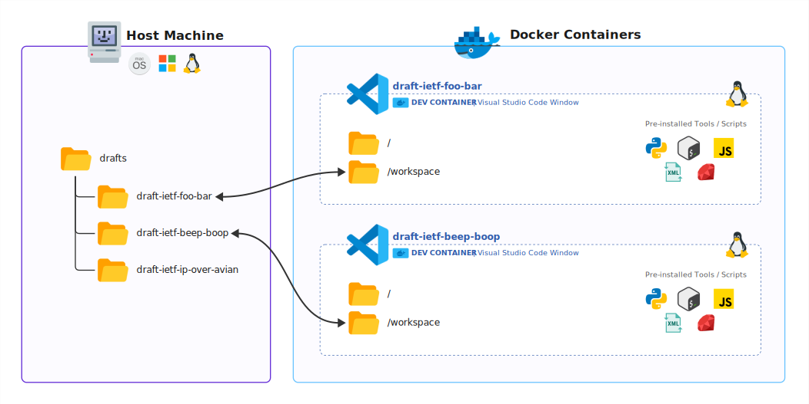

# RPC Workflow

This page details the full workflow for working on a draft by the RPC.

## Intro to Dev Containers

A dev container is an isolated linux environment running virtually on your machine. It includes pre-installed tools and other dependencies required for your work.

Containers are ephemeral and can be destroyed when no longer needed. They can be recreated as necessary, providing a clean working environment.

Because containers are completely isolated environments, you cannot access paths from your local machine from within the container, nor can you invoke programs installed locally. It's often easier to think of containers as a remote machine you're accessing via SSH.

However, we can map a folder from your local machine to a folder inside the container. As such, any changes you make to that folder on the host machine will also be reflected inside the container, and vice-versa.

In our case, the repository folder from the local machine will always be mounted at path `/workspace` inside the container. For example, if you open a dev container from path `~/drafts/draft-ietf-foo-bar` on your local machine, it will be mounted as `/workspace` inside the container. If you create an XML file named `ada-lovelace.xml` inside the container at path `/workspace/ada-lovelace.xml`, it will also appear on your local machine at path `~/drafts/draft-ietf-foo-bar/ada-lovelace.xml`.

Each repository folder will have its own dev container. For the same reason that you cannot see the host machine from within a container, you cannot access another container from a container. Using the same analogy of remote machines, you could connect via SSH to different remote machines but both are completely isolated from each other and have no knowledge of the other.

It's important to note that opening a dev container in Visual Studio Code results in the window being exclusively inside the context of the dev container. Anything you do inside that window, from creating files, to using the integrated terminal, is done inside that dev container. Once you close the window, the dev container is stopped. You can reopen the dev container at any time afterwards to restart the devcontainer and continue where you left off.

You can open multiple dev containers at once. For example, if you need to work on 2 different drafts at the same time, simply open the dev container for each draft. You will end up with 2 Visual Studio Code windows. You can copy/paste contents and files between both windows, as you would between any 2 applications.

{ style="display: block; border-radius: 10px;" }

## Prerequisites

1. Install the [GitHub CLI](https://cli.github.com/) on your machine and authenticate:
    - Open Terminal and run the command: `gh auth login`
    - Follow the instructions to login to your GitHub account.
2. Install [Docker Desktop](https://www.docker.com/products/docker-desktop/) for macOS/Windows. On Linux, install docker from your package manager rather than Docker Desktop.
3. Install [Visual Studio Code](https://code.visualstudio.com/)
4. Launch **Visual Studio Code** and install the extension pack:
    - In the left activity bar, click the **Extensions** icon.
    - Search for "`draftforge`" and install the [**DraftForge for the RFC Production Center**](https://marketplace.visualstudio.com/items?itemName=ietf.draftforge-rpc) extension pack.
5. Create a folder, in the location of your choice, that will contain all drafts (e.g. `~/drafts`).

## Creating a new repository

1. From the [rfc-editor-drafts](https://github.com/rfc-editor-drafts) organization page, click the green **New** button.
2. Enter a repository name. This should match the draft name (without versions), e.g. `draft-ietf-foo-bar`.
3. Enter a description *(usually the full title of the draft)*.
4. Set the repository visibility to **Public**.
5. Set the "Start with a template" to `rfc-editor-drafts/base-template`.
6. Click **Create repository**.

## Cloning a repository locally

1. From the repository page, click the green **Code** button.
2. Select the **GitHub CLI** tab and copy the command (starts with `gh repo clone ...`).
3. Open Terminal and navigate to the folder you created in the [Prerequisites](#prerequisites) section (e.g. `~/drafts`).
4. Paste the command and run it to clone the repository locally. A new folder with the draft name will be created under it (e.g. `~/drafts/draft-ietf-foo-bar`).

## Open the repository in Visual Studio Code

1. Navigate to the cloned repository folder (e.g. `cd draft-ietf-foo-bar`)
2. Run the command to open Visual Studio Code in the current folder: `code .`
3. You'll be prompted in the bottom-right corner of the window to reopen the folder to develop in a container. Click the **Reopen in Container** button to do so. If you missed the prompt or didn't get it, press ++f1++ to open the Command Palette and search for "Dev Containers: Reopen in Container".
4. Wait for the devcontainer to initialize. This can take a while the very first time. Click the "Connecting to Dev Container (show log)" link in the bottom-right corner of the window to follow the progress.
5. Once you see the file listing in the left sidebar, the devcontainer is ready.
6. Select a draft XML/Markdown/TXT file to start working on it.

## Switching to a different draft

!!! info
    A devcontainer is unique to each draft. Everything you see in the Visual Studio Code window is specific to the draft you opened the devcontainer with. It is an isolated environment with only the `/workspace` path being mapped to the cloned repository on your local machine. As such, you cannot access other drafts you cloned or other paths of your machine from within the devcontainer.

    For example, the path `~/drafts/draft-ietf-foo-bar` on your machine will be mapped to `/workspace` in the devcontainer for that draft.

    You can however open multiple devcontainers of different drafts at once.

1. Open Terminal and navigate to the folder containing all drafts. (e.g. `~/drafts`)
2. Follow the instructions from the [Cloning a repository locally](#cloning-a-repository-locally) section.
3. Follow the instructions from the [Open the repository in Visual Studio Code](#open-the-repository-in-visual-studio-code). This will launch a new devcontainer specifically for this draft.

If you no longer need to work on a draft, simply close the Visual Studio Code window for this particular draft. The devcontainer will be stopped automatically. You can come back to it later and continue from the state it was when you left it.

You can have multiple devcontainers opened at the same time. Each window being a specific draft.

You can copy content between windows using the clipboard. However, you cannot access the filesystem of another devcontainer from the integrated terminal. The integrated terminal is bound to the devcontainer context and can only see its isolated environment, with `/workspace` being the only path mapped to the outside.

While you can create temporary files outside the `/workspace` path, you should always work under the `/workspace` path when possible. Because the `/workspace` path is directly mapped to your local machine, its contents will persist even if the devcontainer is destroyed.

## Committing changes

After making changes to a draft, you should create a commit to save these changes.

1. Click on the Source Control tab in the left activity bar.
2. Enter a message describing the change (e.g. `reformatted section ABCDEF`).
3. Click the blue **Commit** button.
4. Click the blue **Sync Changes** button to push the changes to GitHub.

!!! tip
    You can create as many commits as needed. They are a great way to save a specific point in time and revert back later if needed. You don't need to immediately **Sync Changes** after creating a commit if you want to refine the draft further before pushing all the changes to GitHub.
